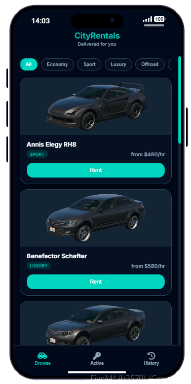
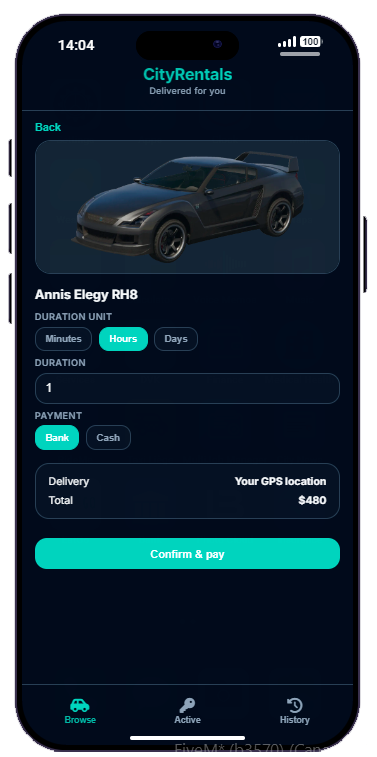
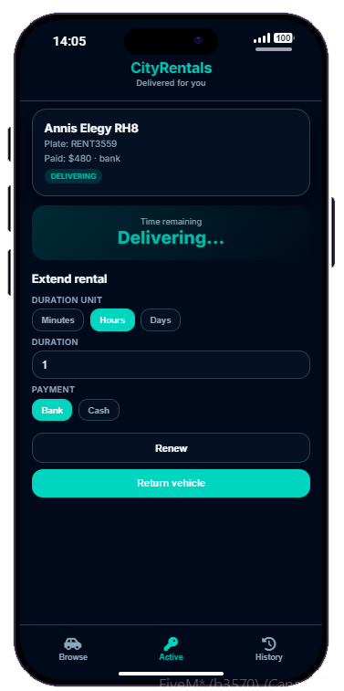
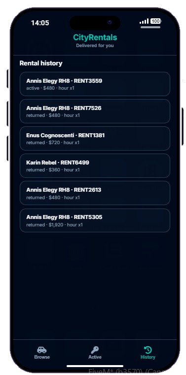

<div align="center">

# CityRentals

**Rent vehicles from LB Phone, NPC delivery to your location, renewals, and returns with fees.**

[](LICENSE)
[](https://docs.lbscripts.com/)
[](https://github.com/marcinhu/lb-phone-cityrentals/releases)

[Features](#features) · [Screenshots](#screenshots) · [Installation](#installation) · [Configuration](#configuration) · [Support](#support)

</div>

---

## About

**CityRentals** is a free custom app for [LB Phone](https://docs.lbscripts.com/). Players browse a rental fleet by category, pay with cash or bank, and receive the vehicle via an **NPC driver** who navigates to their GPS and hands over the keys. Active rentals support timers, renewals, expiry warnings, returns with damage/late fees, and optional abandoned-vehicle handling.

Designed for roleplay servers that want on-demand rentals without a physical rental desk — everything happens inside the phone.

---

## Features

| | |
|---|---|
| **Catalog** | Fleet by category — Economy, Sport, Luxury, Offroad, Super |
| **Billing** | Rent by minute, hour, or day; pay with **cash** or **bank** |
| **NPC delivery** | Driver spawns nearby, pathfinds to the player, key handoff animation |
| **Stuck fallback** | Optional teleport if the driver cannot reach you in time |
| **Active rental** | Live timer, renew from the app, LB Phone expiry notifications |
| **Returns** | Damage and late fees; optional NPC pickup on return (configurable) |
| **Abandoned** | Auto-expire when the player stays too far from the vehicle |
| **Locales** | English and Portuguese |
| **Themes** | Dark / light — follows LB Phone display settings |
| **Frameworks** | Auto-detects **QBCore**, **Qbox**, and **ESX** |
| **Vehicle keys** | `qb-vehiclekeys`, `qbx_vehiclekeys`, `cd_garage`, `wasabi_carlock`, or native unlock |

All server logic uses **`lib.callback`** (no business logic over net events). Keys are granted **client-side** when delivery completes.

---

## Screenshots

<div align="center">

### Browse & rent


&nbsp;&nbsp;


### Active rental & history


&nbsp;&nbsp;


</div>

---

## Requirements

| Dependency | Required |
|---|---|
| [lb-phone](https://docs.lbscripts.com/) | Yes |
| [oxmysql](https://github.com/overextended/oxmysql) | Yes |
| [ox_lib](https://github.com/overextended/ox_lib) | Yes |
| QBCore / Qbox / ESX | One of these |

### Optional — vehicle keys (first match wins)

| Resource | Behaviour |
|---|---|
| [qb-vehiclekeys](https://github.com/qbcore-framework/qb-vehiclekeys) | 
| [qbx_vehiclekeys](https://github.com/Qbox-project/qbx_vehiclekeys) |
| [cd_garage](https://docs.codesign.pro/paid-scripts/garage) |
| [wasabi_carlock](https://docs.wasabiscripts.com/) |
| *(none)* | Unlocks doors natively |

---

## Installation

### 1. Download

Clone or download this repository into your resources folder:

```
resources/[phone]/m-carrental
```

### 2. Database

Tables are created automatically when the resource starts (`cityrentals.sql` is applied via oxmysql). Manual import is optional — use `cityrentals.sql` only if you prefer to run it yourself in HeidiSQL/phpMyAdmin.

### 3. Add to server.cfg

Make sure dependencies start **before** CityRentals:

```cfg
ensure oxmysql
ensure ox_lib
ensure lb-phone
ensure m-carrental
```

### 4. Configure

Open `shared/config.lua` and adjust settings to your liking (see [Configuration](#configuration) below).

### 5. Restart

Restart your server or run:

```
ensure m-carrental
```

Open **LB Phone** → install/open **CityRentals** (not a default app).

---

## Configuration

All main settings live in `shared/config.lua`:

```lua
Config.Locale = 'en'
Config.AppName = 'CityRentals'
Config.MaxActiveRentals = 1
Config.DamageFeePercent = 0.15
Config.LateFeePercent = 0.10
```

| Setting | Description | Default |
|---|---|---|
| `Config.Locale` | UI and server message language | `'en'`, `'pt'` |
| `Config.Vehicles` | Models, labels, categories, images, prices | See `config.lua` |
| `Config.Delivery` | NPC model, blip, speeds, stuck check, fallback teleport | See `config.lua` |
| `Config.DamageFeePercent` | Return fee (% of rental price) | `0.15` |
| `Config.LateFeePercent` | Late return fee (% of rental price) | `0.10` |
| `Config.LateGraceMinutes` | Grace before late fee | `5` |
| `Config.ExpiryWarningMinutes` | Notify before expiry | `10` |
| `Config.Abandoned` | Distance / time before auto-expire | `120m`, `12min` |
| `Config.PickupReturn` | Optional NPC pickup on return | `enabled`, fee `50` |
| `Config.MaxActiveRentals` | Concurrent rentals per player | `1` |

Framework and vehicle-key detection are automatic.

---

## Locales

Translation files are located in `locales/`:

| Code | Language |
|---|---|
| `en` | English |
| `pt` | Portuguese |

To add a new language, create `locales/xx.lua` following the same structure as `locales/en.lua` and set `Config.Locale` accordingly.

---

## How it works

1. Player rents a vehicle in the app and pays.
2. Server creates a `delivering` rental row and returns spawn data.
3. Client spawns the NPC + vehicle, drives to the player, then completes delivery on the server.
4. Rental becomes `active`; the client grants keys.
5. Player can **renew**, **return** (with fees), or lose the rental on expiry / abandonment.

Delivery runs **client-side** (each player sees their own NPC). The resource `ui_page` is a blank `ui/nui.html` so the app UI only appears inside LB Phone — not on the full game screen.

---

## Project structure

```
m-carrental/
├── bridge/
│   ├── framework/          # ESX / QBCore money & player
│   └── vehiclekeys/        # Client-only GiveKeys adapters
├── client/
│   ├── client.lua          # LB Phone app, NUI, rental sync
│   └── delivery.lua        # NPC delivery flow
├── server/
│   └── server.lua          # Callbacks, payments, DB
├── shared/
│   ├── config.lua
│   ├── bridge.lua
│   └── locale.lua
├── locales/
├── ui/                     # Phone UI (index.html — LB Phone)
├── ui/nui.html             # Empty transparent page (resource ui_page)
├── docs/screenshots/       # README images (add your own)
├── cityrentals.sql
└── fxmanifest.lua
```

---

## Troubleshooting

| Issue | Check |
|---|---|
| App not in phone | `lb-phone` started before `m-carrental`; F8 for `[cityrentals] Could not register app` |
| Catalog empty | `ox_lib`, `oxmysql`, framework; wait for LB Phone `componentsLoaded` |
| No keys | Console on start: `Vehicle keys: …`; ensure the right key resource is running |
| Splash / logo on full screen | `ui_page` must be `ui/nui.html`; restart the resource |

---

## Support

This script is **free**. If you find it useful, a star on GitHub goes a long way.

| | Link |
|---|---|
| Discord | [discord.gg/8cp3UDEeR2](https://discord.gg/8cp3UDEeR2) |
| Store | [marcinhu.tebex.io](https://marcinhu.tebex.io) |
| GitHub | [github.com/marcinhu/lb-phone-cityrentals](https://github.com/marcinhu/lb-phone-cityrentals) |

For bugs and feature requests, please open an issue on GitHub or reach out on Discord.

---

## Credits

- Built for [LB Phone](https://docs.lbscripts.com/) by [LB Scripts](https://lbscripts.com/)
- Developed by **[marcinhu](https://marcinhu.tebex.io)**

---

## License

This resource is released **free of charge**. You may use, modify, and redistribute it on your server. Please do not re-upload and sell it as your own work.

<div align="center">

**Made for roleplay servers that want rentals on the go.**

</div>
